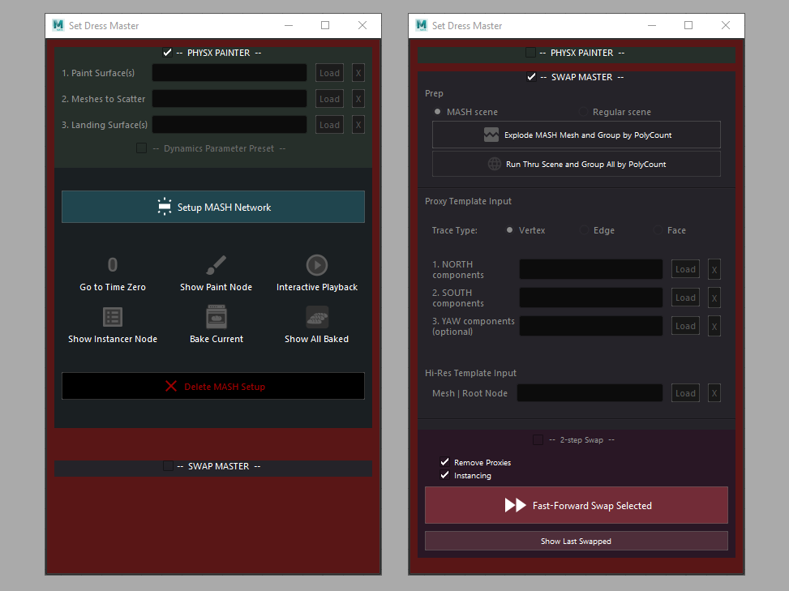
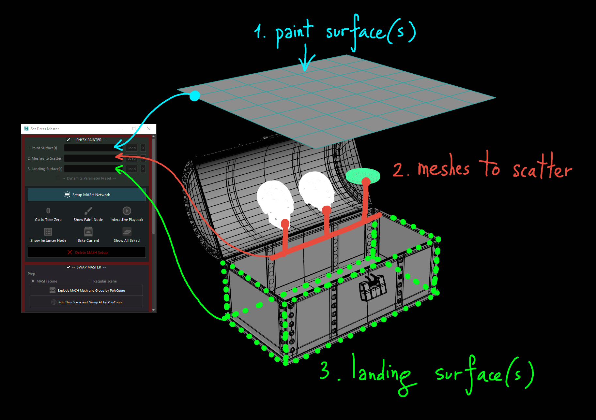
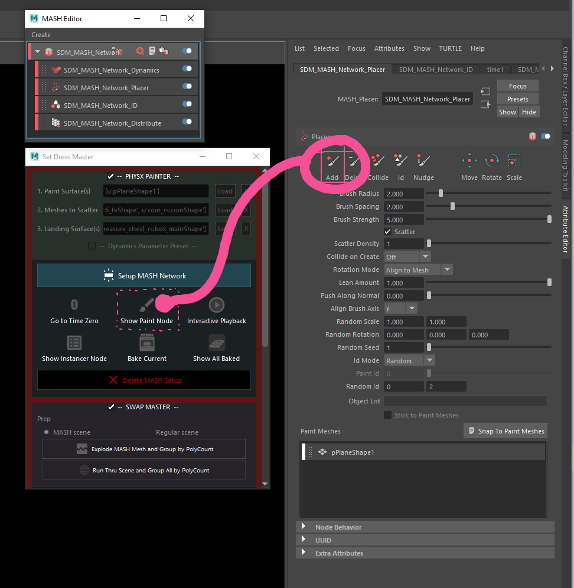
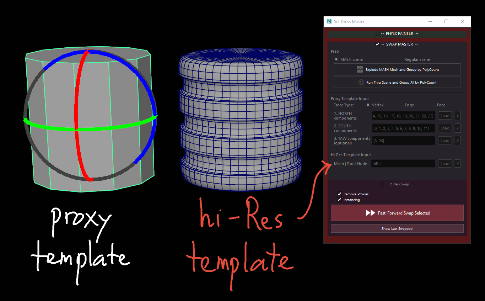
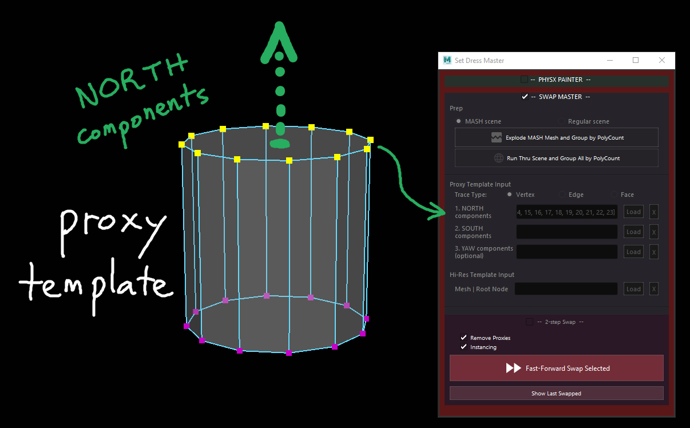
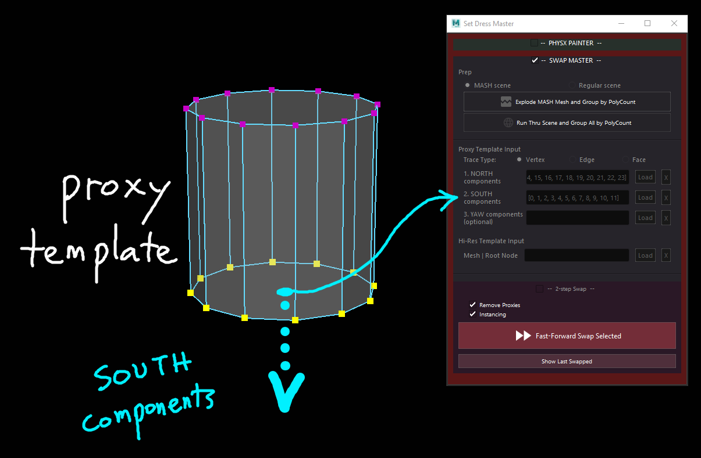
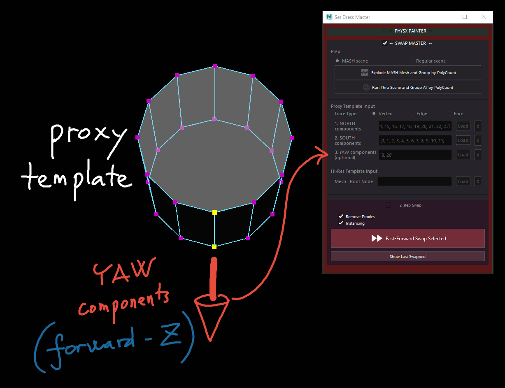
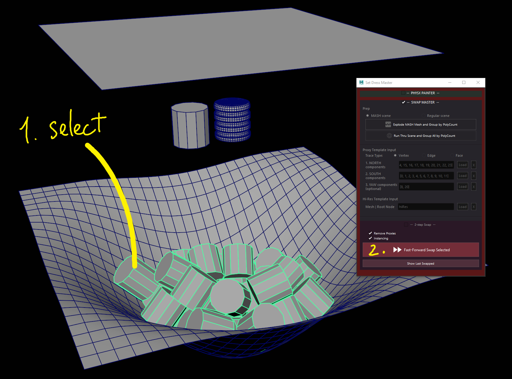
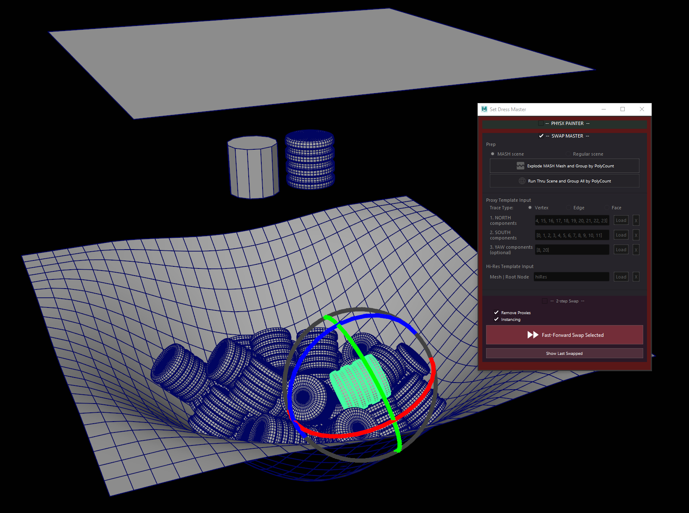

// :imagesdir: E:/projects/mk_dcc/docs/setDressMaster

Set Dress Master
================
Utilities to efficiently perform set dressing in Autodesk Maya

:Author: Truong CG Artist, Mushogenshin, Rkxg
:Revision: 0.1.2

Author: {author}

Version: {revision}

''''
=== Quick Guides
**Set Dress Master** includes two sets of functionalities:

.  **PhysX Painter**, which utilizes Maya's native **MASH** plugin and its dynamics simulation in order to aid set dressing 
.  **Swap Master**, which allows for restoring scattered objects' transforms, and by doing so optionally reconstructing the instancing

.Compatibility
IMPORTANT: Maya 2017 and above

''''
===== 1. PhysX Painter

This section of the UI allows for easily taking advantage of the **MASH** system and the **Bullet Solver** to quickly place the objects while having them look "physically correct".

.Load the paint surface(s), the meshes to scatter, and the landing surface(s), by pressing the respective `Load` button

*  After providing the elements above, press `Setup MASH Network`

.To start painting we'll need to access the `Add` brush in the Attribute Editor of the Paint (Placer) node

*  `Go to Time Zero` if need be. Dynamics simulation usually requires this to function properly
*  Press `Show Paint Node` if the Attribute Editor isn't focusing to the Paint (Placer) node as shown above
*  Press `Interactive Playback` and then the `Add` brush
*  You can now start painting -- onto the paint surface(s) specified
*  At any point during simulation you can press `Bake Current` to store a snapshot of the simulated meshes at that moment

NOTE: See more in Details section below

===== 2. Swap Master

This section of the UI allows for "swapping" scattered, combined, meshes, with desired geometry, preferably together with the ability to restoring their transforms, and optionally reconstructing the instancing.

.Some terminologies:
[NOTE]
================================
*  Proxy Template: one "canonical" of the scattered proxies that still has its original transforms, preferably one of the same meshes given as input prior to doing the PhysX Paint.

*  Hi-Res Template: the optional, more detailed, mesh, from which to duplicate|instance and swap the scattered proxies with. If not given, Swap Master will use the Proxy Template above to do the swapping.
================================

.Proxy template should be the one that still retains its transforms

WARNING: Currently the algorithm for restoring the transforms requires the user to provide a "North pole", a "South pole", and a "Yaw axis". This may not be feasible with every type of geometry. Future releases will include additional algorithms to compensate for this limitation.

.Providing traces to restore transforms
****
.Providing North components

.Providing South components

.Providing Yaw components

****

Then we're ready to perform the swap on selection.

*  Select the scattered group you want to swap
*  Press `Fast-Forward Swap Selected`

.Remember to select either the objects or their group on which you want to run the swapping

.Result: the shown scattered mesh has its transforms restored, and is swapped by the given hi-res template -- optionally as an instance

NOTE: See more in Details section below

''''
=== Details

===== 1. PhysX Painter

After painting and baking the frames you want from the simulation, usually you'll want to move to the next stage of reconstructing the instancing for the scattered meshes. 

*  To do this, first remove all things related to the MASH network by pressing `Delete MASH Setup`. 

CAUTION: For safety purposes, remember to save your scene first, as the **MASH** plugin has some bugs that might cause crash when performing this cleanup.

*  Press `Show All Baked` in order to select all the meshes cloned whenever you pressed `Bake Current`.

===== 2. Swap Master

Since scattered meshes using **MASH** are all combined into one "ReproMesh", methods of preparing the scattered meshes for swapping are given.

*  `Explode MASH Mesh and Group by PolyCount`: works on selection
*  `Run Thru Scene and Group All by PolyCount`: works globally on current scene

After perform the swap:

*  Press `Show Last Swapped` in order to select the swapping results.

=== Installation

*  Download the package
*  Go to `install/maya/setDressMaster`, then drag'n'drop the file `setDressMaster.py` there into Maya viewport
*  Please allow PyMEL several seconds to load
*  A button with `SDM` icon will be created in the current shelf

=== Known Issues

*  Undo is not supported
*  [Version `0.1.1`] `Compute Scale` may not work well with `Instancing` option, causing the meshes to jump. If you want both `Compute Scale` and `Instancing` options, we recommend providing a hi-Res template as well.

=== Road Map

*  [PhysX Painter] Allow for face selection as input for both paint and landing surfaces
*  [PhysX Painter] Allow for scale variability during painting

=== Recent Changes
*  Fixed obsolete `long` in Python 3 for Maya 2022
*  [Swap Master] Added support for computing scale during swapping since version `0.1.1`
